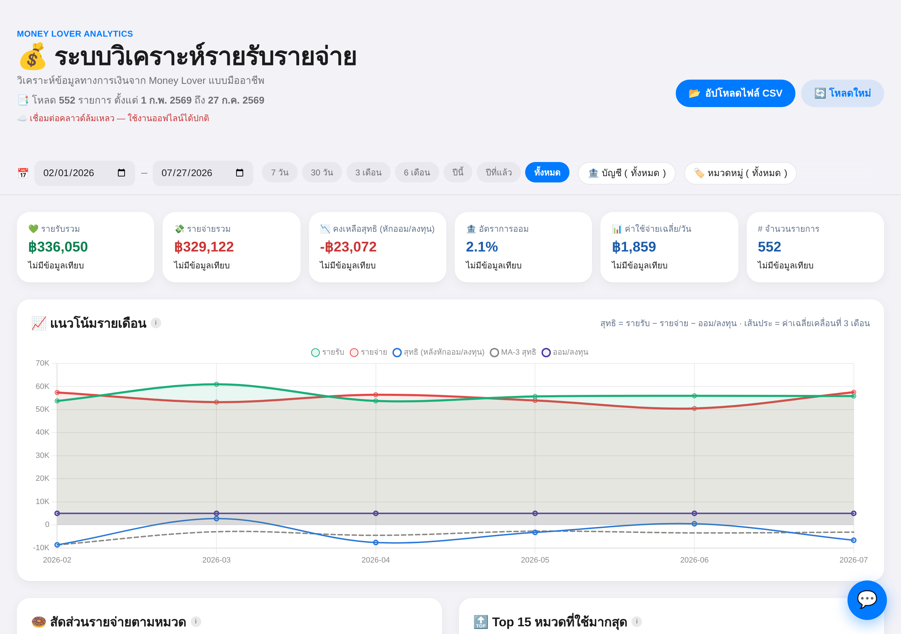
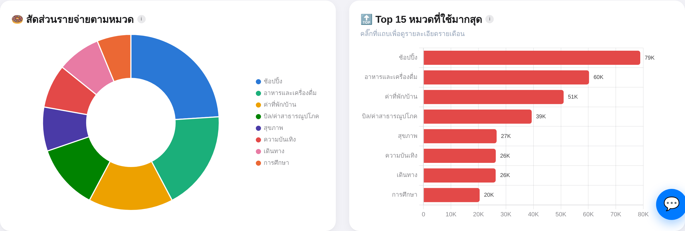

<div align="center">
  

  <h1>💰 Money Lover Analytics — ระบบวิเคราะห์รายรับรายจ่าย</h1>

  <p>วิเคราะห์ข้อมูลการเงินจากแอป <b>Money Lover</b> แบบมืออาชีพ ผ่านไฟล์ CSV<br/>
  ทำงานทั้งหมดในเบราว์เซอร์ ไม่ต้องติดตั้ง ไม่ต้องมีเซิร์ฟเวอร์ พร้อม <b>ผู้ช่วย AI</b> วิเคราะห์การเงินให้</p>
</div>

<p align="center">
  
</p>

---

## ✨ ภาพรวม

Money Lover Analytics คือหน้าเว็บไฟล์เดียว (`index.html`) ที่ช่วยเปลี่ยนไฟล์ CSV ที่ export จากแอป Money Lover ให้กลายเป็นแดชบอร์ดวิเคราะห์การเงินที่อ่านง่าย พร้อมกราฟ ตัวชี้วัด และผู้ช่วย AI ที่ตอบคำถามเรื่องเงินของคุณได้

- 🔒 **ประมวลผลในเบราว์เซอร์ทั้งหมด** — ข้อมูลไม่ถูกอัปโหลดไปไหน (ยกเว้นเปิดใช้ Cloud Sync / AI เอง)
- ⚡ **ไม่ต้องติดตั้ง** — เปิดไฟล์ `index.html` หรือโฮสต์บน GitHub Pages ได้เลย
- 🎨 **ดีไซน์สไตล์ iOS** — รองรับมือถือและเดสก์ท็อป

---

## 🚀 เริ่มต้นใช้งาน

1. **Export ข้อมูลจาก Money Lover**
   - เปิดแอป Money Lover → **ตั้งค่า → Export ข้อมูล**
   - เลือกรูปแบบ **CSV**
   - ส่งไฟล์มาที่อีเมล/คอมพิวเตอร์
2. **เปิดแอป** — เปิด `index.html` ในเบราว์เซอร์ (หรือเข้าเว็บที่โฮสต์ไว้)
3. **อัปโหลดไฟล์ CSV** — ลากไฟล์ลงหน้าเว็บ หรือกดปุ่ม **📂 อัปโหลดไฟล์ CSV**

เท่านี้แดชบอร์ดก็พร้อมใช้งาน 🎉

> ไฟล์ CSV ต้องมีคอลัมน์มาตรฐานของ Money Lover: `Date`, `Amount`, `Category`, `Account`, `Note`, `Event`, `Currency`, `Exclude Report`

---

## 📊 ฟีเจอร์หลัก

### ตัวชี้วัด (KPI) และแนวโน้ม
สรุปตัวเลขสำคัญในช่วงเวลาที่เลือก — รายรับรวม, รายจ่ายรวม, คงเหลือสุทธิ (หักออม/ลงทุน), อัตราการออม, ค่าใช้จ่ายเฉลี่ยต่อวัน และจำนวนรายการ พร้อมกราฟ **แนวโน้มรายเดือน** ที่แสดงเส้นค่าเฉลี่ยเคลื่อนที่ 3 เดือน

### วิเคราะห์รายหมวด
<p align="center">
  
</p>

- 🍩 **สัดส่วนรายรับ/รายจ่ายตามหมวด** — โดนัทชาร์ต บอกว่าเงินไปอยู่ที่หมวดไหน
- 🔝 **Top 15 หมวดที่ใช้มากสุด** — คลิกที่แถบเพื่อดูกราฟรายเดือนและ **พยากรณ์ค่าใช้จ่าย** ของหมวดนั้น
- 🏦 **รายจ่ายแยกตามบัญชี** — ดูว่าบัญชีไหนถูกใช้มากที่สุด
- 🎉 **วิเคราะห์ Event** — รวมต้นทุนของกิจกรรมที่ติด Event Tag เดียวกัน (ทริปเที่ยว งานแต่ง เทศกาล ฯลฯ)
- 💵 **เงินสดในมือ / Burn rate** — ประเมินอัตราการใช้เงินและเงินคงเหลือ

### 💼 มูลค่าบัญชี & วิเคราะห์เทียบรายจ่าย
ตอบคำถามว่า *"ตอนนี้แต่ละบัญชีมีเงินเท่าไหร่ และเงินก้อนนั้นจะอยู่ได้อีกนานแค่ไหน"*

- 💰 **มูลค่าคงเหลือรายบัญชี** — ผลรวมทุกรายการของบัญชีนั้นตั้งแต่รายการแรก ถึงวันสุดท้ายของช่วงที่เลือก (รวมโอนภายในและรายการบัตรเครดิต เพราะเงินเคลื่อนเข้าออกบัญชีจริง)
- ⚖️ **มูลค่า vs รายจ่ายเฉลี่ย/เดือน** — กราฟแท่งคู่ เทียบ "เงินที่มี" กับ "เงินที่จ่ายออก" ของแต่ละบัญชีในภาพเดียว
- 📈 **มูลค่าบัญชีสิ้นเดือนย้อนหลัง** — เส้นแยกรายบัญชี พร้อมเส้นประรวมทุกบัญชี ดูว่ามูลค่ากำลังโตหรือถูกกินลง
- ⏳ **Runway รายบัญชี** — มูลค่า ÷ รายจ่ายเฉลี่ยต่อเดือน = อยู่ได้อีกกี่เดือน จัดระดับสุขภาพเป็น 🟢 แข็งแรง (6 เดือน+) · 🟡 พอใช้ (3–6) · 🟠 ตึงตัว (1–3) · 🔴 วิกฤต/ติดลบ
- 📋 **ตารางเปรียบเทียบรายบัญชี** — % ของเงินที่มี, % ของรายจ่าย, อัตราไหลออกต่อเดือน (รายจ่ายคิดเป็นกี่ % ของยอดคงเหลือ) · คลิ๊กที่แถวเพื่อดูกราฟมูลค่า vs รายจ่ายรายเดือนของบัญชีนั้น
- 💡 **สรุปอัตโนมัติ** — เตือนบัญชีที่เงินจะหมดก่อน, บัญชีที่ยอดติดลบ, เงินที่จอดอยู่เฉยๆ และการกระจุกตัวของมูลค่า

> ⚠️ ตัวเลขคำนวณจากรายการใน CSV เท่านั้น — ถ้าตั้ง **ยอดยกมา (initial balance)** ไว้ใน Money Lover โดยไม่มีรายการรองรับ ยอดคงเหลือจะต่างจากในแอป ให้บันทึกยอดตั้งต้นเป็นรายการหนึ่งเพื่อให้ตรงกัน

### ตัวกรองและตาราง
- 📅 กรองตามช่วงวันที่ (มีปุ่มลัด 7 วัน / 30 วัน / 3 เดือน / 6 เดือน / ปีนี้ / ปีที่แล้ว / ทั้งหมด)
- 🏦 กรองตามบัญชี · 🏷️ กรองตามหมวดหมู่ (ค้นหาได้)
- 📋 **ตารางรายการธุรกรรม** — ค้นหา เรียงลำดับ และแบ่งหน้า

### แชร์และซิงก์ (ทางเลือก)
- 🔗 **แชร์ลิงก์** — แชร์แดชบอร์ดให้คนอื่นดูได้
- ☁️ **Cloud Sync** ผ่าน Firebase (ปิดไว้โดยค่าเริ่มต้น — เปิดได้โดยใส่ `firebaseConfig` ของตัวเอง)

---

## 🤖 ผู้ช่วย AI วิเคราะห์การเงิน

<p align="center">
  
</p>

กดปุ่มแชท 💬 มุมขวาล่างเพื่อคุยกับ **เลขา AI** ที่วิเคราะห์ข้อมูลการเงินของคุณและตอบเป็นภาษาไทย ขับเคลื่อนด้วย **Google Gemini**

**ความสามารถ**
- 💬 ถามคำถามอิสระ เช่น "หมวดไหนใช้เยอะสุด" · "เดือนไหนใช้จ่ายผิดปกติ" · "ช่วยแนะนำวิธีลดรายจ่าย"
- ⚡ **ปุ่มด่วน (Quick Actions)** — กดปุ่มหัวข้อเพื่อถามคำถามยอดนิยมทันทีโดยไม่ต้องพิมพ์ (สรุปเดือนนี้ · หมวดไหนใช้เยอะ · รายการผิดปกติ · วิธีประหยัด · แนวโน้มรายจ่าย · รายจ่ายประจำ · แนะนำงบประมาณ · อยากเก็บเงิน · มูลค่าบัญชี)
- 🗂 **หลายห้องแชท** และเลือกรุ่นโมเดล Gemini ได้
- 🃏 **การ์ดตัวเลือกโต้ตอบ** — AI ถามกลับพร้อมปุ่มให้กดเลือก

**โหมดการเชื่อมต่อ** (กด ⚙️ ในหน้าต่างแชท)

| โหมด | คำอธิบาย | เหมาะกับ |
|------|----------|----------|
| 🔑 **คีย์ส่วนตัว** | วาง Gemini API key ของคุณเอง (ขอฟรีที่ [aistudio.google.com/apikey](https://aistudio.google.com/apikey)) — เก็บไว้ในเครื่องเท่านั้น | ใช้ส่วนตัว |
| 🌐 **Proxy** | ยิงคำถามผ่าน Firebase Cloud Function — ผู้ใช้ไม่ต้องมี key เอง | แชร์ให้หลายคนใช้ร่วมกัน |

AI ยังได้รับสรุป **มูลค่าคงเหลือแต่ละบัญชีเทียบรายจ่ายและ runway** (ปัดเศษและปิดบังชื่อบัญชีเหมือนข้อมูลส่วนอื่น) จึงตอบคำถามอย่าง "บัญชีไหนเงินจะหมดก่อน" ได้

> 🔐 **ความเป็นส่วนตัว:** ไม่ว่าโหมดไหน AI จะได้รับเฉพาะ **ยอดสรุปแบบปิดบังตัวตน** (ปัดเศษ, ชื่อบัญชีแทนด้วย A/B/C, ไม่มีรายการดิบหรือโน้ต) และทุกคำตอบมีปุ่ม **"👀 ดูข้อมูลที่ส่งไป"** ให้ตรวจสอบได้ว่าส่งอะไรออกไปบ้าง

การตั้งค่าโหมด Proxy ดูรายละเอียดที่ [`functions/README.md`](functions/README.md)

---

## 🗂️ โครงสร้างโปรเจกต์

```
Money-lover/
├── index.html            # แอปทั้งหมด (UI + ตรรกะวิเคราะห์ + แชท AI)
├── favicon-*.svg         # ไอคอนให้เลือก
├── firebase.json         # คอนฟิก Firebase (สำหรับ AI proxy)
├── functions/            # Firebase Cloud Function (โหมด AI Proxy)
│   ├── index.js
│   └── README.md         # วิธีตั้งค่า Gemini proxy
└── docs/images/          # ภาพประกอบสำหรับ README
```

---

## 🛠️ เทคโนโลยีที่ใช้

- **HTML/CSS/JavaScript** ล้วน (ไฟล์เดียว ไม่มี build step)
- [Tailwind CSS](https://tailwindcss.com/) — ระบบดีไซน์
- [Chart.js](https://www.chartjs.org/) + datalabels — กราฟทั้งหมด
- [PapaParse](https://www.papaparse.com/) — อ่านไฟล์ CSV
- [Firebase](https://firebase.google.com/) (ทางเลือก) — Cloud Sync + AI Proxy
- [Google Gemini](https://ai.google.dev/) — ผู้ช่วย AI

---

## 🔐 ความเป็นส่วนตัว

- ข้อมูล CSV ถูกประมวลผล **ในเบราว์เซอร์เท่านั้น** โดยค่าเริ่มต้น
- **Cloud Sync** ปิดอยู่ จนกว่าคุณจะใส่ `firebaseConfig` ของตัวเอง
- **AI** จะทำงานเมื่อคุณเชื่อมต่อเอง และส่งเฉพาะยอดสรุปที่ปิดบังตัวตนแล้วเท่านั้น
- API key ในโหมดคีย์ส่วนตัวถูกเก็บใน `localStorage`/`sessionStorage` ของเครื่องคุณ ไม่ sync ขึ้นคลาวด์ และไม่ติดไปกับลิงก์แชร์

---

<div align="center">
  <sub>สร้างเพื่อช่วยให้การจัดการเงินส่วนบุคคลเข้าใจง่ายขึ้น 💙</sub>
</div>
